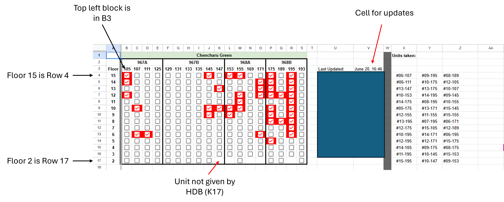
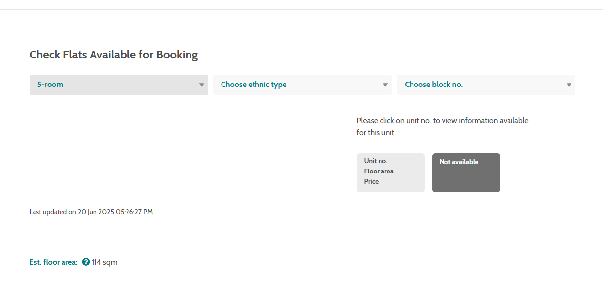

# 🏠 HDB BTO Unit Availability Scraper + Google Sheets Updater

This project is a **semi-automated Python tool** to help you track and visualize flat availability during HDB BTO launches. It scrapes unit data from the HDB sales portal (after login), detects changes in availability, and updates a structured Google Sheet for easier selection.

---

## 📌 Features

- ✅ Scrapes unit availability by block and floor from the HDB portal  
- ✅ Detects **newly taken or released units** since the last run  
- ✅ Batch-updates a Google Sheet with:
  - Checkboxes indicating unit availability
  - A vertical list of units taken (`#Floor-Unit` format)
  - A timestamp of last update
- ✅ Supports **multiple blocks and future launches**

---

## ⚙️ Requirements

- Python 3.7+
- Google Chrome installed
- Manual login to [HDB BTO Portal](https://homes.hdb.gov.sg/home/)

Python libraries used (automatically installed by the scripts):
- `selenium`
- `webdriver-manager`
- `gspread`
- `oauth2client`

---

## 🚀 Setup

### 1. Clone the repository
```bash
git clone https://github.com/your-username/hdb-bto-scraper.git
cd hdb-bto-scraper
```

### 2. Prepare your Google Sheets API

- Create a Google Cloud project with Sheets + Drive API enabled

- Download your service account .json credentials

- Rename it appropriately (e.g., credentials.json) and place it in the same folder as the scripts

### 3. Configure `updater.py`
Edit updater.py to:

```python
# Replace with your actual filenames
"PRIVATE CREDENTIALS HERE.json" → private credentials from google
"GOOGLE SHEET NAME" → Name of the Google Sheet
"ACTUAL SHEET NAME" → Name of the worksheet within the Google Sheet
```

### 4. Configure `unit_scraper.py`
Edit unit_scraper.py to the list of blocks you want to scrape:

```python
blocks = ["Blk 1", "Blk 2"]
```
This says the dropdown menu in HDB site is 'Blk 1' and 'Blk 2'.

### 5. Configure Google Sheets
As hinted in Step 3, we would need Google Sheets for this. Here is a sample google sheet screenshot from the project I was working on.

It is imperative that you set up something really similar for the script to work properly. I have (hopefully) listed the important points on the sheet.



Make sure you add your Google Sheets "Bot Thing" as an editor. If you don't know whats going on, can ask ChatGPT haha.


## 🧪 How to Use

### 1. Set up Chrome Debugging
Start Chrome with remote debugging enabled:
```bash
chrome.exe --remote-debugging-port=9222 --user-data-dir="C:/chrome-debug"
```
Then log in manually to the HDB website and navigate to the BTO unit availability page.




### 2. Run the Scraper
```bash
python unit_scraper.py
```

- Selects each block (e.g., Blk 1, Blk 2 etc.)

- Scrapes all units for that block

- Saves results to all_blocks_units.json

- Saves changes (if any) to unit_changes.json


### 3. Run the Updater
```bash
python updater.py
```

- Updates checkboxes for each unit in your Google Sheet

- Adds newly taken units to the #Floor-Unit list in columns X:AI

- Leaves specific cells untouched (e.g., K17, L17, etc.)

- Updates timestamp in cell V3 (e.g., 18 Jun, 11:31)

## 🧩 File Structure

```graphql
.
├── unit_scraper.py          # Scrapes units from HDB website
├── updater.py               # Updates Google Sheet based on scrape
├── credentials.json         # Your Google API credentials
├── all_blocks_units.json    # Most recent scrape
├── unit_changes.json        # Detected changes (if any)
```

## 🔒 Notes

- This tool requires manual login due to Singpass authentication

- Avoid running too frequently — Google Sheets API has quota limits (~60 write calls/min)

- Supports flexible adaptation to other BTO projects — just update the block list and sheet layout as needed

## 📄 License

MIT License. You are free to use, modify, and distribute with attribution.